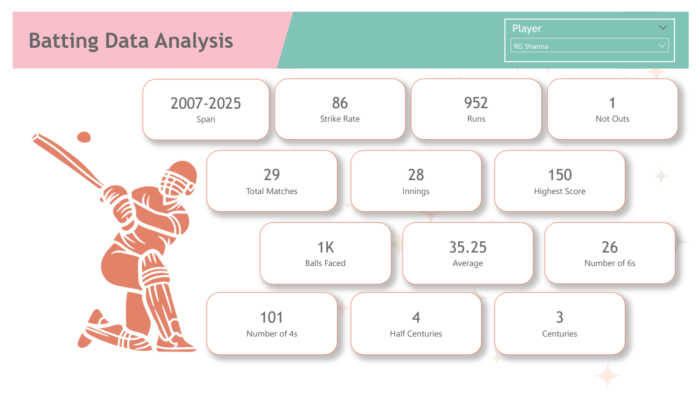
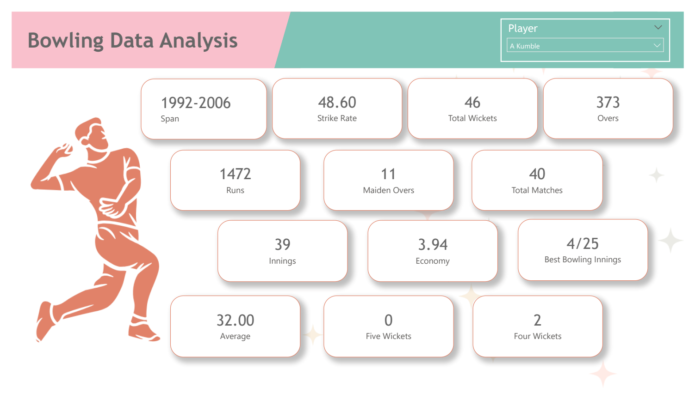

# ESPN Cricket Data Analysis
Power BI | Web Scraping | DAX | Data Analytics

## Project Summary
End-to-end cricket performance analysis using web-scraped data from ESPN Cricinfo and Power BI.   
The project analyzes India vs South Africa ODI performance across batting, bowling, and fielding to uncover player trends, rankings, and performance insights.

### Project Objective
To analyze India vs South Africa ODI cricket performance using real-world web data and deliver interactive insights through Power BI dashboards.

### Tools & Technologies
- Power BI Desktop & Power BI Service
- Power Query (ETL & Web Scraping)
- DAX (LOOKUPVALUE, RANKX, ABS, POWER)
- ESPN Cricinfo (Web Data Source)

### Key Responsibilities
- Extracted cricket data directly from ESPN Cricinfo (Statsguru) using Power BI Web connector
- Automated data collection across multiple paginated web pages
- Cleaned and standardized raw HTML data using Power Query
- Built calculated columns and player rankings using DAX
- Designed interactive, multi-page Power BI dashboards
- Published reports to Power BI Service

### Key Metrics & Analysis
- Batting performance analysis (Runs, Strike Rate, Player Categories)
- Bowling performance analysis (Wickets, Economy, Strike Metrics)
- Fielding performance insights
- Player ranking using RANKX
- Strike rate categorization using LOOKUPVALUE
- Performance deviation from average metrics

### Dashboard Highlights
- Dedicated analysis pages for Batting, Bowling, and Fielding
- Player-level dropdown slicers for focused analysis
- KPI card visuals for quick performance comparison
- Consistent visual theme across report pages

## How to Use the Dashboard
- Use the **Player slicer** to analyze individual performance
- Navigate between **Batting, Bowling, and Fielding** pages
- KPI cards provide quick comparison across players

### Business Insights
- Identified top-performing and low-performing players across disciplines
- Strike rate categorization highlights aggressive vs consistent batters
- Ranking logic enables fast player comparison
- Deviation metrics help detect standout player performances

### Outcome
Delivered a production-ready Power BI dashboard enabling interactive evaluation of cricket player performance using real-world web data.

### Skills Demonstrated
- Data Analysis & Visualization
- Web Scraping & Automation
- Data Cleaning & Transformation (ETL)
- Power BI & DAX
- Analytical Storytelling

## Power BI Dashboard Preview

### Batting Performance Analysis

## Bowling Analysis

## Fielding Analysis

